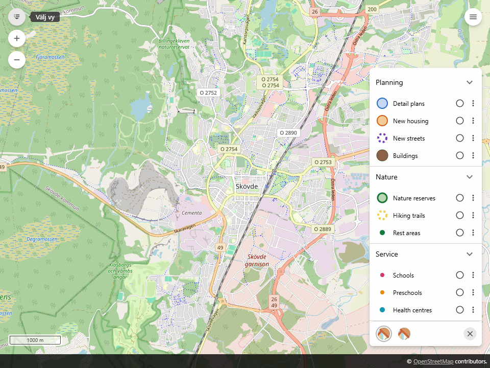

# Origo Theme Selector

[](LICENSE)
[](#installation)

## What does it do?

Adds a "Select view" button to Origo's navigation toolbar. Its panel holds map
themes: click a theme to enable its layers, select a background and optionally
move the map. Click again to switch its layers off and get the previous
background back. Written in vanilla JavaScript, with no build step.



## Installation

Copy `theme-selector.js` and `theme-selector.css` to `plugins/theme-selector/`
in your Origo installation. Load them after Origo's own CSS and JavaScript:

```html
<link rel="stylesheet" href="plugins/theme-selector/theme-selector.css">
<script src="plugins/theme-selector/theme-selector.js"></script>
```

## Example

Add this inside your existing map's `load` handler in `index.html`:

```js
origo.on('load', function (viewer) {
  viewer.addComponent(ThemeSelector({
    exclusive: true,
    icon: '#ic_map_24px',
    themes: [
      {
        name: 'planning',
        title: { 'sv-SE': 'Planering', 'en-US': 'Planning' },
        icon: '#ic_place_24px',
        groups: ['planning'],
        layers: ['some_layer'],
        exclude: ['buildings'],
        background: 'orthophoto',
        center: [435000, 6485000],
        zoom: 12
      },
      {
        name: 'buildings',
        title: 'Byggnader',
        layers: ['buildings'],
        combinable: true
      }
    ]
  }));
});
```

Use your own group and layer names, and coordinates in the map's projection.
Themes can also live in your map's JSON configuration and be passed in from
there. A complete example is in [examples/index.html](examples/index.html).
Serve it from `plugins/theme-selector/examples/` in an Origo installation. Its
layers are made-up demo data around Skövde, with OpenStreetMap and
[Sentinel-2 cloudless](https://s2maps.eu) by EOX (CC BY 4.0) as backgrounds,
so the example needs an internet connection. Origo draws the first layer in the
configuration on top, so background layers go last.

## Configuration

| Option | Default | Meaning |
| --- | --- | --- |
| `themes` | `[]` | Array of themes, see below. Nothing is rendered without themes. |
| `exclusive` | `true` | Activating a normal theme deactivates other normal themes. Set `false` to allow all themes together. |
| `labels` | `false` | Set `true` to show each theme's title as text next to its icon in the panel, instead of only in a tooltip. Recommended for maps used on touch screens, where tooltips never appear. |
| `title` | `Välj vy` / `Select view` | Main button title. String or `{ 'sv-SE': …, 'en-US': … }`. |
| `icon` | `#ic_map_24px` | Main button icon, and the fallback for themes whose icon is missing. |
| `iconPrefix` | `#` | Prefix for icons given without `#`. With `'#theme_'`, `icon: 'park'` means `#theme_park`. |
| `target` | Origo's navigation | Container ID. |
| `before` | `.o-zoom` | Selector of the element in the target to insert the button before. Set `false` to append it last. |
| `includeSubgroups` | `false` | Set `true` to let `groups` also enable layers in nested groups. |
| `iconTimeout` | `10000` | Milliseconds to wait for a sprite before a missing icon falls back. |

| Theme option | Meaning |
| --- | --- |
| `name` | Required and unique. Themes without a name or with a duplicate name are skipped with a console warning. |
| `title` | Button title. String or Swedish/English object; defaults to the name. |
| `icon` | SVG symbol ID from a sprite loaded by the map. Origo does not wait for its sprites before the map loads, so the selector waits up to `iconTimeout` for the symbol. An ID that is still missing gives a console warning and the main icon. |
| `groups` | Enable layers in these Origo groups. Nested groups only with `includeSubgroups`. |
| `layers` | Explicit layer names to enable. |
| `exclude` | Exclude layer names from group selection. Explicit `layers` entries take precedence. |
| `background` | Switch to this layer in the `background` group. When no active theme has a background any longer, the previous background comes back, unless the background was changed elsewhere. |
| `center`, `zoom` | Supply both, as numbers, to move the map when activated. |
| `combinable` | Defaults to `false`. Set `true` to keep this theme active alongside a normal theme. |

`groups`, `layers` and `exclude` accept an array or a single name. Unknown
layers, groups and backgrounds, background layers listed in `layers`, invalid
`center`/`zoom` and non-string icons give a console warning when the selector
is added.

## Behaviour

- A layer shared by two active themes stays on when one of them is switched off.
- If the user switches off every layer of an active theme elsewhere, for example in the legend, its button is deactivated as well.
- The panel opens to the left when it does not fit inside the map, checked when it opens and when the map is resized. Themes wrap onto more rows when the panel is wider than the screen.
- The panel closes with Escape or a click outside it. Escape only moves focus back to the main button if focus was inside the selector.
- Buttons use Origo's own tooltip and `aria-pressed`; the panel is a labelled group controlled by the main button. With `labels: true` the theme buttons show their title as text and have no tooltip.
- Titles use Origo's language when the selector is added. Origo reloads the page when the language changes.

## Limitations

- Previous layer visibility is not restored. A layer that was on before a theme was activated is switched off with the theme, also when the component is removed.
- The map position is not restored.
- Layers and groups added after the selector are not tracked.
- OpenLayers `GROUP` layers are treated as a whole; their children cannot be selected or excluded individually.
- No source filters, permalink handling or public activation API. Use one selector per map.

## Compatibility

- Verified with Origo `2.11.0-dev`. Other versions are untested; please open an issue if the selector does not work with yours.
- Uses these Origo APIs: `Origo.ui.Component`, `viewer.addComponent`, `getLayers`, `getGroups`, `getMain().getNavigation()` and, if present, the `localization` control. Buttons rely on Origo's `o-tooltip` CSS.
- Origo must be loaded before `theme-selector.js`; otherwise the selector logs an error and is not defined.
- Needs a current browser (Chrome, Edge, Firefox, Safari). Internet Explorer is not supported.

See [CHANGELOG.md](CHANGELOG.md) for changes between versions.
